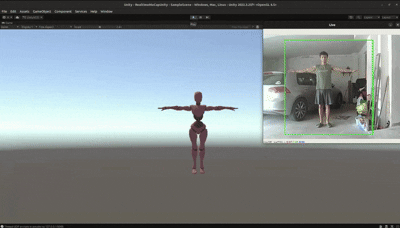
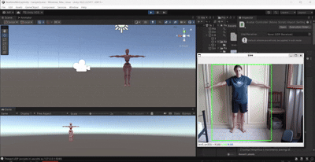

# Correzione hip & leg

## Scleta modello: MMDetection + HybrIK

Facendo altri test su tutti e tre i modelli, abbiamo notato che nella pipeline MMDetection + HybrIK l'anca era già sbloccata di base, ma il movimento non (spostamenti poco controllati, gambe rigide e che con movimenti non corretti). Le sezioni seguenti descrivono le modifiche fatte per affinarlo.

Test MMDetection + HybrIK iniziale


Test MMDetection + HybrIK finale (dopo le correizioni)


## 1. Mirroring L/R sulle gambe

Aggiunta una mappa e un flag per scambiare i dati tracciati tra gamba sinistra e destra, più tre switch per invertire la rotazione su un singolo asse quando serve.

```csharp
[Header("Modalità Specchio (gambe)")]
public bool mirrorLegs = false;
public bool invertLegRotationX = false;
public bool invertLegRotationY = false;
public bool invertLegRotationZ = false;

private static readonly Dictionary<string, string> legMirrorMap = new Dictionary<string, string>
{
    { "L_Hip", "R_Hip" }, { "R_Hip", "L_Hip" },
    { "L_Knee", "R_Knee" }, { "R_Knee", "L_Knee" },
    { "L_Ankle", "R_Ankle" }, { "R_Ankle", "L_Ankle" },
    { "L_Foot", "R_Foot" }, { "R_Foot", "L_Foot" }
};
```

Inversione per-asse applicata al quaternion grezzo, prima di salvarlo:

```csharp
if (legBoneNames.Contains(item.Key) &&
    (invertLegRotationX || invertLegRotationY || invertLegRotationZ))
{
    raw = new Quaternion(
        invertLegRotationX ? -raw.x : raw.x,
        invertLegRotationY ? -raw.y : raw.y,
        invertLegRotationZ ? -raw.z : raw.z,
        raw.w
    );
}
```

Scelta dell'osso target (mirrorato o no) prima di applicare la rotazione:

```csharp
string targetBoneName = item.Key;

if (mirrorLegs && legMirrorMap.TryGetValue(item.Key, out string mirroredName))
{
    targetBoneName = mirroredName;
}
```

## 2. Movimento più realistico

Prima la dead zone (soglia sotto cui il movimento viene ignorato) era unica per tutte le ossa. Ora le gambe hanno una soglia più bassa, così i micro-movimenti non vengono scartati rendo più realistico il movimento del manichino.

```csharp
[Range(0f, 5f)]
public float rotationDeadZone = 0.15f;

[Range(0f, 5f)]
public float legRotationDeadZone = 0.05f;

[Range(1f, 60f)]
public float legSmoothing = 14f;

[Range(1f, 100f)]
public float legFastSmoothing = 35f;
```

Scelta dei parametri in base al tipo di osso, subito prima dello smoothing:

```csharp
bool isLegBone = legBoneNames.Contains(item.Key);

float deadZone = isLegBone ? legRotationDeadZone : rotationDeadZone;
float baseSmoothing = isLegBone ? legSmoothing : smoothing;
float fastSmoothingValue = isLegBone ? legFastSmoothing : fastSmoothing;

boneTransform.localRotation = SmoothRotation(
    boneTransform.localRotation,
    targetRotation,
    Time.deltaTime,
    deadZone,
    baseSmoothing,
    fastSmoothingValue
);
```

`SmoothRotation` è stata modificata per ricevere questi parametri invece di leggerli sempre dalle variabili globali:

```csharp
private Quaternion SmoothRotation(
    Quaternion current,
    Quaternion target,
    float deltaTime,
    float deadZone,
    float baseSmoothing,
    float fastSmoothingValue)
{
    float angle = Quaternion.Angle(current, target);

    if (angle < deadZone)
        return current;

    float normalizedAngle = Mathf.Clamp01(angle / 45f);
    float adaptiveSmoothing = Mathf.Lerp(baseSmoothing, fastSmoothingValue, normalizedAngle);
    float t = 1f - Mathf.Exp(-adaptiveSmoothing * deltaTime);

    return Quaternion.Slerp(current, target, t);
}
```

## 3. Amplificazione della rotazione delle gambe

Aggiunta una funzione che amplifica l'angolo del delta di rotazione mantenendo lo stesso asse, applicata solo alle ossa delle gambe sempre per rendere il movimento migliore.

```csharp
[Range(1f, 3f)]
public float legSwingBoost = 1.6f;
```

```csharp
private Quaternion AmplifyRotation(Quaternion delta, float factor)
{
    if (Mathf.Approximately(factor, 1f))
        return delta;

    if (delta.w < 0f)
    {
        delta = new Quaternion(-delta.x, -delta.y, -delta.z, -delta.w);
    }

    delta.ToAngleAxis(out float angle, out Vector3 axis);
    angle *= factor;

    return Quaternion.AngleAxis(angle, axis);
}
```

Applicazione, subito dopo il calcolo del delta rispetto alla calibrazione:

```csharp
Quaternion delta = Quaternion.Inverse(calibration) * raw;

bool isLegBone = legBoneNames.Contains(item.Key);

if (isLegBone)
{
    delta = AmplifyRotation(delta, legSwingBoost);
}
```

## 4. Oscillazione del bacino (hip sway)

Funzione puramente procedurale, basata sul tempo di Unity, che aggiunge un piccolo movimento continuo al bacino sempre per rendere il movimento più realistico e meno "rigido".

```csharp
[Header("Movimento naturale del bacino (idle sway)")]
public bool enableHipSway = true;

[Range(0f, 3f)]
public float hipSwayAmount = 1.2f;

[Range(0.05f, 1f)]
public float hipSwaySpeed = 0.25f;
```

```csharp
private Quaternion GetHipSwayOffset()
{
    if (!enableHipSway)
        return Quaternion.identity;

    float t = Time.time * hipSwaySpeed * Mathf.PI * 2f;
    float sway = Mathf.Sin(t) * hipSwayAmount;
    float bob = Mathf.Sin(t * 2f) * (hipSwayAmount * 0.3f);

    return Quaternion.Euler(bob, 0f, sway);
}
```

Applicata sopra alla rotazione tracciata, solo sul bacino:

```csharp
if (targetBoneName == "Pelvis")
{
    targetRotation = targetRotation * GetHipSwayOffset();
}
```

## Conclusione

Nel complesso le modifiche hanno riguardato solo lo script AvatarController.cs lato Unity. Il movimento della root position, già presente ma grezzo, è stato reso più controllato con scala, limite massimo e smoothing dedicati. Le gambe, che risultavano rigide e a volte specchiate, sono state sistemate con mirroring L/R, dead zone dedicata e amplificazione della rotazione. Infine l'oscillazione del bacino aggiunge un minimo di naturalezza anche quando il tracking resta fermo. Il risultato complessivo è un avatar che si muove nello spazio in modo più fluido e con gambe/bacino meno "legnosi" rispetto alla versione di partenza.
