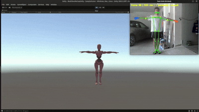
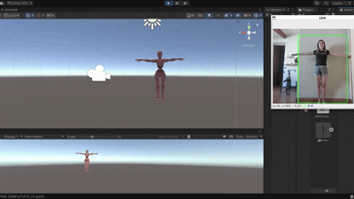

# Riconoscimento dei Movimenti Umani da Video

## e loro Riproduzione su Avatar 3D in Unity

_Un sistema di motion capture markerless basato su computer vision, comunicazione UDP e retargeting scheletrico in tempo reale_

**Tesina di progetto — Image processing and computer vision 2026**

---

# Abstract

Questo lavoro descrive la progettazione e l'implementazione di un sistema in grado di analizzare un video contenente una persona, riconoscerne i movimenti tramite tecniche di computer vision e riprodurli in tempo reale su un avatar 3D umanoide all'interno del motore grafico Unity. Sono state analizzate e confrontate tre diverse pipeline di stima della posa umana: **Scenario A, basato su SAM3DBody-cpp; Scenario B, basato sulla combinazione AlphaPose + HybrIK; Scenario C, basato sulla combinazione MMDetection + HybrIK**. Le tre soluzioni sono state valutate in termini di output prodotto, complessità computazionale, dettaglio dello scheletro e adeguatezza rispetto al task di animazione in tempo reale.

È stata progettata un'architettura di comunicazione comune basata sul protocollo UDP, attraverso la quale i dati di posa vengono serializzati in formato JSON e trasmessi dal modulo di computer vision al motore Unity. Un modulo di ricezione multithreaded acquisisce i pacchetti senza bloccare il rendering, mentre il componente di retargeting scheletrico associa le rotazioni ricevute alle ossa dell'avatar Humanoid e le applica mediante interpolazione. Il formato JSON condiviso permette di mantenere indipendente il lato Unity dalla specifica pipeline di computer vision utilizzata.

Il sistema è stato validato tramite test di simulazione locale e collegamento delle pipeline al medesimo modulo di ricezione, verificando il corretto funzionamento della catena end-to-end. Sono infine discusse possibili estensioni relative alla gestione simultanea di più persone nella scena e all'interazione dell'avatar con gli oggetti e l'ambiente circostante.

---

# 1. Introduzione

L'obiettivo del progetto è realizzare una pipeline completa di **motion capture**: a partire da un flusso video (webcam o file) contenente una persona, il sistema deve riconoscere la posa del corpo umano e riprodurla fedelmente sul movimento di un avatar 3D in Unity, in tempo reale e senza l'uso di sensori indossabili o marker fisici.

L'architettura complessiva è divisa in tre macro-blocchi, che comunicano tramite rete locale:

- **Acquisizione e stima della posa (Python / C++):** un modello di computer vision individua la persona nel frame ed estrae le rotazioni o le posizioni 3D delle sue articolazioni.
- **Trasmissione dati (UDP):** i dati di posa vengono serializzati in JSON e inviati via socket UDP verso una porta locale ascoltata da Unity.
- **Ricezione e animazione (Unity / C#):** uno script riceve il pacchetto, lo decodifica e applica le rotazioni alle ossa dell'avatar Humanoid tramite retargeting scheletrico e interpolazione sferica (Slerp).

### Flusso dati generale

```text
[ Video / Webcam ]
        |
        v
[ Modello CV: SAM3DBody-cpp / AlphaPose+HybrIK / MMDetection+HybrIK ]
        |
        |   JSON via UDP (porta 5065)
        v
[ UDPReceiver.cs ]  --thread background-->  latestJSON
        |
        v
[ AvatarController.cs ]  (LateUpdate, Slerp/Lerp)
        |
        v
[ Avatar 3D Humanoid (X-Bot) in scena Unity ]
```

Nei capitoli seguenti si analizzano dapprima i principali framework di stima della posa disponibili in letteratura (capitolo 2), per poi descrivere nel dettaglio i tre scenari architetturali analizzati (capitolo 3), le relative pipeline di computer vision (capitolo 4), il protocollo di comunicazione (capitolo 5), l'integrazione con Unity (capitolo 6), i test effettuati (capitolo 7) e le possibili estensioni del sistema (capitolo 8).

---

# 2. Stato dell'arte: Human Pose Estimation e Human Mesh Recovery

Il riconoscimento della posa umana da immagini o video è un problema centrale della computer vision, affrontato con approcci molto diversi tra loro a seconda del tipo di output richiesto. Si distinguono principalmente tre categorie:

1. **Stima della posa 2D**, che restituisce i keypoint sul piano dell'immagine.
2. **Stima della posa 3D**, che restituisce coordinate spaziali dei giunti.
3. **Human Mesh Recovery**, che ricostruisce l'intera superficie corporea tramite modelli parametrici come SMPL o le sue evoluzioni.

Nella fase preliminare del progetto sono stati analizzati numerosi framework esistenti, al fine di individuare la soluzione più adatta al vincolo del tempo reale e alla compatibilità con Unity.

| Algoritmo        | Categoria              | Output                | Punto di forza                              |
| ---------------- | ---------------------- | --------------------- | ------------------------------------------- |
| OpenPose         | 2D Pose                | Keypoint 2D           | Storico, multi-persona, ma lento            |
| AlphaPose        | 2D Pose                | Keypoint 2D/3D        | Accurato, realtime, tracking multi-persona  |
| MMPose           | Framework              | Pose 2D/3D/Mesh       | Modulare, molti modelli disponibili         |
| VoxelPose        | Multi-view 3D          | Pose 3D multi-persona | Robusto a occlusioni, richiede più camere   |
| HybrIK           | Human Mesh Recovery    | Mesh SMPL             | Inverse kinematics, molto accurato          |
| 4D-Humans (HMR2) | Human Mesh Recovery    | Mesh SMPL             | Stato dell'arte, richiede GPU potente       |
| SAM3DBody        | Human Mesh Recovery    | Mesh MHR + rig        | Rig dettagliato (~70 giunti), pesante       |
| SAM3DBody-cpp    | Mesh Recovery realtime | Mesh MHR + BVH        | Runtime C++/ONNX, nessuna dipendenza Python |

Da questa analisi comparativa sono emerse tre strategie percorribili per il progetto, descritte nel capitolo successivo come **Scenario A, Scenario B e Scenario C**.

---

# 3. Architettura del sistema e scelta dell'approccio

La scelta della pipeline di computer vision determina direttamente il tipo di dati che devono essere trasferiti al motore Unity e il modo in cui tali dati vengono utilizzati per animare l'avatar.

Nel corso del progetto sono stati analizzati e testati tre scenari architetturali distinti, accomunati dalla stessa fase finale di comunicazione UDP verso Unity.

I tre approcci differiscono principalmente per il modo in cui viene ottenuta la posa tridimensionale e per il modello utilizzato per rappresentare lo scheletro umano:

- **Scenario A:** utilizza direttamente SAM3DBody-cpp, che integra detection, stima della posa e ricostruzione del rig MHR in un'unica pipeline C++.
- **Scenario B:** utilizza AlphaPose insieme a HybrIK per ottenere la posa 3D e le rotazioni articolari.
- **Scenario C:** utilizza MMDetection come detector e HybrIK per la ricostruzione della posa 3D.

## 3.1 Scenario A — SAM3DBody-cpp

Nel primo scenario l'intera pipeline di stima della posa viene affidata a **SAM3DBody-cpp**, implementazione C++ del modello SAM-3D-Body.

Il sistema riceve direttamente il flusso video, individua la persona e ricostruisce il corpo umano utilizzando il modello **MHR (Momentum Human Rig)**.

L'output comprende un rig articolato con un numero di giunti significativamente superiore rispetto allo scheletro SMPL utilizzato da HybrIK, permettendo di rappresentare in maggiore dettaglio anche mani, dita e piedi.

I dati prodotti dalla pipeline vengono convertiti nel formato utilizzato dal progetto e inviati tramite UDP a Unity. Poiché il modello fornisce direttamente informazioni di orientamento delle articolazioni, il lato Unity può applicare le rotazioni ricevute alle ossa corrispondenti senza richiedere un solutore di cinematica inversa generico.

---

## 3.2 Scenario B — AlphaPose + HybrIK

Nel secondo scenario **AlphaPose viene utilizzato insieme a HybrIK**.

La pipeline combina quindi due componenti:

- **AlphaPose**, utilizzato per l'elaborazione del video e l'individuazione della persona;
- **HybrIK**, utilizzato per la ricostruzione tridimensionale del corpo e il calcolo delle rotazioni articolari.

Il vantaggio di questa configurazione consiste nella separazione tra il rilevamento della persona e la successiva ricostruzione della posa 3D.

HybrIK fornisce le informazioni tridimensionali e le matrici di rotazione dei **24 giunti SMPL**. Le rotazioni possono quindi essere convertite nel formato utilizzato da Unity e trasmesse direttamente tramite UDP.

Questo scenario rappresenta una soluzione intermedia tra la pipeline integrata di SAM3DBody-cpp e quella basata su un detector general-purpose.

---

## 3.3 Scenario C — MMDetection + HybrIK

Nel terzo scenario la fase di rilevamento della persona viene affidata a **MMDetection**, mentre la stima della posa tridimensionale viene eseguita da **HybrIK**.

A differenza dello Scenario B, in questo caso MMDetection viene utilizzato specificamente come detector: il modello individua la persona nel frame e restituisce una **bounding box**, che viene successivamente utilizzata per ritagliare la regione di interesse da fornire a HybrIK.

La bounding box viene inoltre stabilizzata tramite uno smoothing temporale e la detection non viene necessariamente eseguita a ogni frame, così da ridurre il carico computazionale.

HybrIK riceve quindi il ritaglio della persona e restituisce:

- matrici di rotazione dei 24 giunti SMPL;
- coordinate tridimensionali dei giunti;
- traslazione della radice dello scheletro.

Le rotazioni vengono convertite nel formato utilizzato dal sistema Unity e inserite nello stesso schema JSON condiviso dagli altri scenari.

---

## 3.4 Confronto tra i tre scenari

| Scenario | Pipeline             | Detection                | Pose / Mesh Recovery | Output utilizzato da Unity |
| -------- | -------------------- | ------------------------ | -------------------- | -------------------------- |
| **A**    | SAM3DBody-cpp        | Integrata nella pipeline | SAM-3D-Body / MHR    | Rotazioni del rig MHR      |
| **B**    | AlphaPose + HybrIK   | AlphaPose                | HybrIK / SMPL        | Rotazioni + joint 3D       |
| **C**    | MMDetection + HybrIK | MMDetection              | HybrIK / SMPL        | Rotazioni + joint 3D       |

Tutti e tre gli scenari convergono nello stesso modulo di comunicazione e animazione: i dati di posa vengono serializzati in JSON, inviati tramite UDP e successivamente elaborati da Unity.

Questa scelta consente di confrontare direttamente le diverse pipeline di computer vision mantenendo invariata la parte finale del sistema.

---

# 4. Pipeline di Computer Vision analizzate

Per la fase di estrazione della posa sono state analizzate tre pipeline, corrispondenti ai tre scenari architetturali descritti nel capitolo precedente.

Le pipeline condividono il medesimo obiettivo finale, ovvero ottenere informazioni sufficientemente ricche sulla posa umana da poter animare un avatar 3D in Unity, ma utilizzano modelli e rappresentazioni scheletriche differenti.

---

## 4.1 SAM3DBody-cpp — Scenario A

SAM3DBody-cpp costituisce lo **Scenario A** ed è la pipeline maggiormente integrata tra quelle analizzate.

Si tratta di una reimplementazione interamente in C++ del modello SAM-3D-Body di Meta, progettata per l'esecuzione senza dipendenze da un runtime Python.

La pipeline comprende:

1. rilevamento della persona;
2. estrazione delle feature visive;
3. stima dei parametri di posa;
4. applicazione dei parametri al modello MHR.

Il sistema utilizza una rappresentazione del corpo più dettagliata rispetto allo scheletro SMPL, consentendo di rappresentare anche articolazioni delle mani e delle dita.

Nel progetto il programma C++ integra direttamente un socket UDP nel ciclo principale della pipeline. Per ogni persona rilevata viene costruito un pacchetto JSON contenente le rotazioni articolari, le coordinate tridimensionali dei keypoint e la posizione della radice.

Il pacchetto viene quindi inviato verso Unity tramite `sendto()`.

```cpp
int udp_sock = udp_open(c.udp_ip, c.udp_port, udp_addr);

for (int i = 0; i < (int)results.size(); ++i)
    send_pose_udp(
        udp_sock,
        udp_addr,
        i,
        results[i],
        bvh_writer,
        bvh_joint_names
    );

// dentro send_pose_udp():

json << "\"unity_rotations_deg\":{ ... per ogni giunto BVH ...";
json << "\"root_position\":{...}";

sendto(
    sock,
    payload.c_str(),
    payload.size(),
    0,
    (sockaddr*)&addr,
    sizeof(addr)
);
```

Il principale vantaggio di questo approccio è quindi la disponibilità di un rig dettagliato e la possibilità di eseguire l'intera pipeline in C++, riducendo l'overhead dovuto all'interprete Python.

Il limite principale è la maggiore complessità computazionale e di integrazione rispetto alle pipeline basate su modelli SMPL.

---

## 4.2 AlphaPose + HybrIK — Scenario B

Lo **Scenario B** combina AlphaPose e HybrIK.

AlphaPose viene utilizzato per l'elaborazione del video e per l'individuazione della persona, mentre HybrIK viene utilizzato per trasformare le informazioni ottenute in una rappresentazione tridimensionale del corpo umano.

AlphaPose utilizza una pipeline **top-down**, nella quale il detector individua le persone presenti nel frame e la rete di pose estimation analizza ciascuna regione rilevata.

L'output comprende i keypoint della persona e i relativi punteggi di confidenza. Queste informazioni vengono utilizzate come base per la successiva elaborazione tridimensionale.

HybrIK completa la pipeline ricostruendo lo scheletro 3D parametrico **SMPL**.

Il modello utilizza la cinematica inversa per ottenere le rotazioni articolari coerenti con la configurazione tridimensionale del corpo.

Nel progetto vengono utilizzate le matrici di rotazione relative ai **24 giunti SMPL**, successivamente convertite in quaternioni e organizzate per nome di giunto.

Il vantaggio principale dello Scenario B è la possibilità di combinare un sistema di detection e pose estimation consolidato come AlphaPose con un modello di Human Mesh Recovery come HybrIK.

Il risultato è un output più ricco rispetto ai soli keypoint 2D, comprendente sia informazioni tridimensionali sia orientamenti articolari.

Lo svantaggio è rappresentato dalla necessità di eseguire e coordinare due componenti di elaborazione, con un conseguente aumento della complessità della pipeline rispetto a un sistema completamente integrato.

---

## 4.3 MMDetection + HybrIK — Scenario C

Lo **Scenario C** utilizza MMDetection come detector e HybrIK come modello di Human Mesh Recovery.

In questo caso i due moduli hanno responsabilità nettamente separate:

- **MMDetection** individua la persona all'interno dell'immagine tramite una bounding box;
- **HybrIK** riceve la regione ritagliata e ricostruisce la posa tridimensionale.

Nel programma sviluppato, MMDetection viene inizializzato utilizzando una configurazione **Faster R-CNN con backbone ResNet-50 e FPN** e un checkpoint pre-addestrato.

Durante l'elaborazione del frame vengono considerate le detection appartenenti alla classe persona e viene applicata una soglia di confidenza per eliminare i rilevamenti meno affidabili.

Per migliorare la stabilità della regione di interesse, la bounding box viene sottoposta a uno **smoothing temporale**.

Inoltre, la detection può essere eseguita a intervalli regolari anziché a ogni frame. Nei frame intermedi viene mantenuta la bounding box precedentemente filtrata, riducendo il numero di inferenze del detector e migliorando le prestazioni complessive.

La regione individuata viene successivamente preprocessata secondo il formato richiesto da HybrIK e fornita al modello.

HybrIK restituisce:

- matrici di rotazione dei 24 giunti SMPL;
- coordinate 3D dei giunti;
- traslazione della radice.

Le matrici di rotazione vengono convertite in quaternioni e successivamente nei valori utilizzati dal modulo Unity.

```python
JOINT_NAMES = [
    "Pelvis", "L_Hip", "R_Hip", "Spine1",
    "L_Knee", "R_Knee", "Spine2", ...
    "L_Wrist", "R_Wrist"
]


def rotmats_to_quat_dict(theta_mats):
    r = R.from_matrix(theta_mats)
    quats = r.as_quat()

    return {
        name: q.tolist()
        for name, q in zip(JOINT_NAMES, quats)
    }
```

Il risultato viene infine inserito nello stesso schema JSON utilizzato dagli altri scenari, contenente:

- `person_id`;
- `timestamp`;
- `unity_rotations_deg`;
- `joint_xyz_3d`;
- `root_position`.

Il pacchetto viene quindi inviato tramite UDP alla porta 5065 di Unity.

Il principale vantaggio dello Scenario C è la **modularità**: MMDetection può essere utilizzato esclusivamente come modulo di detection, lasciando a HybrIK il compito di ricostruire la posa tridimensionale.

La separazione dei due compiti permette inoltre di intervenire indipendentemente sui parametri del detector e del modello di Human Mesh Recovery.

Rispetto allo Scenario B, la differenza principale consiste quindi nel modulo utilizzato per individuare la persona. AlphaPose fornisce una pipeline specificamente orientata alla pose estimation, mentre MMDetection viene utilizzato come detector general-purpose per ottenere la bounding box che viene successivamente elaborata da HybrIK.

---

# 5. Protocollo di comunicazione UDP

Il collegamento tra l'ambiente di computazione (Python/C++) e l'ambiente di rendering (Unity) avviene tramite protocollo **UDP (User Datagram Protocol)**.

La scelta è motivata dai requisiti di latenza del sistema: a differenza di TCP, che garantisce la consegna ordinata di ogni pacchetto tramite ritrasmissione, UDP invia i dati a flusso continuo senza attesa di conferma.

In un contesto di motion capture in tempo reale un frame di posa "vecchio" non ha alcun valore una volta che ne è disponibile uno più recente.

La perdita occasionale di un pacchetto è quindi accettabile e preferibile al blocco della pipeline in attesa di ritrasmissione, garantendo una latenza ridotta.

## 5.1 Struttura del pacchetto JSON

Tutte e tre le pipeline condividono lo stesso schema di pacchetto, così da rendere lo script di ricezione lato Unity indipendente dalla sorgente dei dati:

```json
{
  "person_id": 0,
  "timestamp": 1784979327.127,
  "unity_rotations_deg": {
    "Pelvis": { "x": -41.53, "y": 12.16, "z": 6.11 },
    "L_Elbow": { "x": 15.69, "y": -2.61, "z": -156.23 }
  },
  "joint_xyz_3d": [0.0, 0.0, 0.0, 0.035, -0.007, 0.015],
  "root_position": {
    "x": -0.088,
    "y": -0.132,
    "z": -4.544
  }
}
```

### Campi principali

- **`person_id`**: identificativo assegnato dal tracciamento, permette di associare ogni pacchetto all'avatar corretto in scenari multi-persona.
- **`timestamp`**: istante in cui il frame è stato elaborato dal modello.
- **`unity_rotations_deg`**: rotazione locale di ciascun giunto dello scheletro, utilizzata per muovere l'avatar.
- **`joint_xyz_3d`**: posizioni relative dei giunti nello spazio 3D, utili per debug, visualizzazione o approcci alternativi.
- **`root_position`**: posizione della radice dello scheletro rispetto alla telecamera, utilizzata per traslare l'intero avatar nella scena.

Le tre pipeline differiscono principalmente per il set di nomi di giunto utilizzato.

HybrIK utilizza lo schema SMPL a 24 giunti, mentre SAM3DBody-cpp utilizza uno schema più esteso basato sul rig MHR/BVH.

---

# 6. Integrazione in Unity

## 6.1 Configurazione dell'avatar Humanoid

Come modello 3D è stato scelto **X-Bot**, disponibile gratuitamente su Mixamo, scaricato in formato FBX binario in T-Pose.

La T-Pose costituisce la posizione di riferimento necessaria per calcolare correttamente le rotazioni locali a riposo.

Dopo l'importazione nel progetto Unity, nella scheda **Rig** dell'Inspector l'`Animation Type` è stato impostato su **Humanoid**.

Questa operazione fa sì che Unity mappi automaticamente la gerarchia di ossa specifica del modello sullo standard interno `HumanBodyBones`, rendendo lo scheletro indipendente dalle proporzioni della mesh e compatibile con script di animazione basati su tale standard.

---

## 6.2 UDPReceiver.cs — ricezione di rete

Il componente `UDPReceiver.cs` ascolta la porta UDP locale (`5065`) su un thread in background dedicato, separato dal thread principale di rendering di Unity.

Questo evita di introdurre cali di framerate durante l'attesa bloccante sulla funzione:

```csharp
UdpClient.Receive()
```

L'ultimo pacchetto ricevuto viene salvato in una variabile di stringa condivisa (`latestJSON`), protetta da un `lock` per evitare race condition tra il thread di rete e il ciclo principale.

```csharp
private void ReceiveData()
{
    IPEndPoint localEndPoint =
        new IPEndPoint(IPAddress.Parse("127.0.0.1"), port);

    client = new UdpClient(localEndPoint);

    IPEndPoint remoteEndPoint =
        new IPEndPoint(IPAddress.Any, 0);

    while (running)
    {
        byte[] data = client.Receive(ref remoteEndPoint);

        string text =
            Encoding.UTF8.GetString(data);

        lock (lockObject)
        {
            latestJSON = text;
        }
    }
}
```

---

## 6.3 AvatarController.cs — retargeting e animazione

Il componente `AvatarController.cs`, eseguito in `LateUpdate()`, deserializza il JSON tramite la libreria Newtonsoft Json.

I dati vengono organizzati in classi di supporto:

- `JointData`;
- `MotionPayload`.

Le rotazioni ricevute vengono quindi applicate alle ossa corrispondenti dell'avatar Humanoid.

Per ottenere un movimento fluido viene utilizzata un'interpolazione sferica tramite `Quaternion.Slerp`.

### Mappatura SMPL → Unity Humanoid

| Giunto SMPL              | Osso Humanoid Unity          | Descrizione biomeccanica    |
| ------------------------ | ---------------------------- | --------------------------- |
| Pelvis                   | Hips                         | Bacino / centro di massa    |
| Spine1 / Spine2 / Spine3 | Spine / Chest / UpperChest   | Colonna vertebrale e torace |
| Neck / Head              | Neck / Head                  | Collo e testa               |
| L_Shoulder / R_Shoulder  | LeftUpperArm / RightUpperArm | Braccio superiore           |
| L_Elbow / R_Elbow        | LeftLowerArm / RightLowerArm | Avambraccio                 |
| L_Wrist / R_Wrist        | LeftHand / RightHand         | Polso / mano                |
| L_Hip / R_Hip            | LeftUpperLeg / RightUpperLeg | Coscia                      |
| L_Knee / R_Knee          | LeftLowerLeg / RightLowerLeg | Gamba                       |
| L_Ankle / R_Ankle        | LeftFoot / RightFoot         | Piede                       |

Il ciclo di retargeting può essere rappresentato come segue:

```csharp
foreach (var item in motionData.unity_rotations_deg)
{
    if (boneMap.TryGetValue(
        item.Key,
        out Transform boneTransform))
    {
        Quaternion targetRotation =
            Quaternion.Euler(
                item.Value.x,
                item.Value.y,
                item.Value.z
            );

        boneTransform.localRotation =
            Quaternion.Slerp(
                boneTransform.localRotation,
                targetRotation,
                Time.deltaTime * smoothing
            );
    }
}
```

Il campo `root_position` viene invece applicato tramite una `Vector3.Lerp` sulla posizione locale dell'osso `Hips`, così da traslare l'intero avatar nello spazio in base alla distanza stimata dalla telecamera.

Il parametro `smoothing`, esposto nell'Inspector, regola la reattività dell'interpolazione:

- valori bassi → movimento più morbido ma maggiore ritardo percepito;
- valori alti → minore latenza percepita ma movimento meno fluido.

---

# 7. Test e validazione

La pipeline è stata validata in due fasi.

## 7.1 Test tramite simulazione locale

In una prima fase interna è stato utilizzato un componente `UDPSimulator` temporaneo che inviava pacchetti JSON di prova sulla porta `5065` in locale.

Questo ha permesso di verificare in isolamento:

- ricezione di rete;
- deserializzazione JSON;
- mappatura delle articolazioni;
- retargeting scheletrico;
- animazione dell'avatar.

L'avatar X-Bot ha risposto correttamente muovendo testa e braccia in tempo reale, confermando la correttezza della pipeline:

```text
UDP → parsing JSON → retargeting → animazione Humanoid
```

## 7.2 Test end-to-end

In una seconda fase le tre pipeline di computer vision:

- SAM3DBody-cpp;
- AlphaPose + HybrIK;
- MMDetection + HybrIK;

sono state collegate al medesimo ricevitore Unity.

La verifica ha permesso di controllare che, a parità di formato di pacchetto, l'avatar rispondesse ai dati ricevuti dalle diverse sorgenti.

Questo conferma la bontà della scelta di utilizzare uno **schema JSON condiviso** tra le diverse implementazioni.

Di seguito i video dimostravivi dei test sulle tre metodologie:

**Test di SAM3DBody-cpp eseguito su Linux in CPU mode:**



**Test di MMdetection eseguito su Windows+wsl in GPU mode:**



## 7.3 Limitazioni

Come esplicitato dai video i risultati ottenuti dall'avatar Unity sono spesso solo delle approssimazioni delle pose reali catturate dalla webcam. Ci sono diversi motivi per il quale questo succede e sono distribuiti su tutta la pipeline del framework.

Il primo motivo risiede nella difficoltà intrinseca di una webcam monoculare di stimare la posa univoca di una persona in 3 dimensioni, i modelli di SAM3DBody-cpp e HybrIK provano a risolvere le ambiguità tendendo a regredire la complessità tridimensionale di un movimento umano verso pose piu plausibili.
Altre difficoltà dal punto di vista del campionamento immagine sono le eventuali occlusioni causate, sia da oggetti sulla scena, sia dallo stesso corpo umano che può nascondere arti o incrociarli rendendo più complesso il lavoro di pose estimation della rete neurale.

Dal punto di vista dell'animazione dell'avatar Humanoid di Unity è importante considerare che lo scheletro SMPL e quello di SAM3DBody possiedono una gerarchia di ossa diversa da quello Humanoid, copiare dunque rotazioni tra due rig differenti può introdurre distorsioni nell'animazione. Altre distorsioni sono introdotte se la posa di riferimento del campionatore non coincide perfettamente con la posa di calibrazione dell'Humanoid Unity, le rotazioni locali verrebbero infatti riportate con un offset sistematico.

Infine ci sono i vincoli di sitema real-time. Il framerate della pipeline di computer vision è molto piu basso del refresh di Unity il che costringe l'avatar a inseguire le pose con un ritardo non trascurabile.
A causa del basso framerate del campionatore si verificano anche perdite di picchi di movimento, dovendo Unity interpretare pose distanti nel tempo se nel frattempo la persona ha eseguito un movimento rapido potrebbe non venire campionato e costringere Unity ad approssimarlo molto piu lentamente di quello reale.
Inoltre si aggiunge lo smoothing che Unity effettua in automatico per compensare il rumore delle stime, questo approccio perde di fedeltà per concentrarsi sulla  stabilità dell'annimazione. 

# 8. Estensioni del sistema

Come indicato nell'abstract del progetto, sono state progettate due estensioni dell'architettura di base, orientate rispettivamente alla gestione di scene multi-persona e all'interazione fisica dell'avatar con l'ambiente.

---

## 8.1 Gestione di più persone nella scena

Quando il modulo di detection rileva più persone contemporaneamente, il flusso JSON invia pacchetti con `person_id` distinti:

```text
0, 1, 2, ...
```

Il componente `MultiAvatarManager.cs` mantiene un:

```csharp
Dictionary<int, GameObject>
```

che associa ogni identificativo al proprio avatar instanziato dinamicamente.

Al primo apparire di un nuovo `person_id` viene creato un nuovo avatar:

```csharp
if (!avatarsInScene.ContainsKey(id))
{
    GameObject newAvatar =
        Instantiate(
            avatarPrefab,
            Vector3.zero,
            Quaternion.identity
        );

    avatarsInScene.Add(id, newAvatar);
}

avatarsInScene[id]
    .GetComponent<AvatarPoseController>()
    .UpdatePose(packet);
```

Un secondo dizionario può mantenere il timestamp dell'ultimo pacchetto ricevuto per ciascuna persona.

Se una persona non viene aggiornata per più di una soglia configurabile, l'avatar corrispondente viene rimosso dalla scena.

---

## 8.2 Interazione fisica con oggetti e ambiente

Poiché l'avatar viene mosso forzando direttamente rotazione e posizione delle ossa, per impostazione predefinita esso non collide con l'ambiente come un corpo fisico tradizionale.

Per abilitare l'interazione è possibile utilizzare lo strumento **Ragdoll** integrato in Unity, che aggiunge `Capsule Collider` e `Rigidbody` agli arti principali.

L'architettura prevede:

- `Rigidbody` delle ossa impostati come **Kinematic**;
- collider sugli arti principali;
- uno `Sphere Collider` in modalità `Trigger` sulla mano;
- identificazione degli oggetti interagibili tramite il tag `"Grabbable"`.

Per l'afferramento degli oggetti, quando la mano entra in contatto con un oggetto `Grabbable` e i dati della pose estimation indicano una configurazione compatibile con una mano chiusa, l'oggetto può essere reso figlio della mano.

La fisica dell'oggetto viene temporaneamente disattivata:

```text
Mano chiusa
     |
     v
Trigger Collider
     |
     v
Oggetto Grabbable
     |
     v
Parenting alla mano
     |
     v
Fisica disattivata
```

Quando la mano viene riaperta, l'oggetto viene rilasciato e la fisica viene nuovamente attivata.

La combinazione di ossa Kinematic e script di afferramento tramite parenting consente di ottenere, con un costo implementativo contenuto, un'illusione convincente di interazione fisica tra l'utente ripreso dalla webcam e gli oggetti presenti nella scena Unity.

---

# 9. Conclusioni

Il progetto ha permesso di realizzare e confrontare concretamente **tre strategie di computer vision** per l'animazione real-time di un avatar 3D:

1. **Scenario A — SAM3DBody-cpp**
2. **Scenario B — AlphaPose + HybrIK**
3. **Scenario C — MMDetection + HybrIK**

Lo **Scenario A** rappresenta la soluzione maggiormente integrata, poiché SAM3DBody-cpp combina le diverse fasi di elaborazione e produce un rig MHR dettagliato.

Lo **Scenario B** combina AlphaPose con HybrIK, sfruttando il primo per la fase di analisi della persona e il secondo per la ricostruzione tridimensionale e la stima delle rotazioni.

Lo **Scenario C** separa invece nettamente detection e pose recovery, utilizzando MMDetection per ottenere la bounding box e HybrIK per la ricostruzione dello scheletro SMPL.

Tra le pipeline analizzate, SAM3DBody-cpp si distingue per il dettaglio del rig, comprendente anche informazioni relative a mani e dita, e per l'esecuzione in C++ senza dipendenze dal runtime Python.

Le pipeline basate su HybrIK presentano invece il vantaggio di utilizzare il modello SMPL a 24 giunti e di fornire direttamente informazioni di orientamento articolare, risultando particolarmente adatte al retargeting diretto verso un avatar Humanoid.

Il protocollo UDP con payload JSON condiviso tra le diverse sorgenti si è dimostrato una scelta architetturale efficace, garantendo bassa latenza e disaccoppiamento tra il modulo di visione e il modulo di rendering in Unity.

Come sviluppi futuri si individuano:

- introduzione di un filtro temporale per ridurre ulteriormente il jitter;
- supporto nativo ai quaternioni end-to-end;
- gestione più robusta delle occlusioni;
- supporto multi-persona;
- interazione fisica con gli oggetti;
- calibrazione multi-camera per una ricostruzione 3D più robusta.

---

# Appendice A — Repository e riferimenti

| Progetto      | Repository                          |
| ------------- | ----------------------------------- |
| AlphaPose     | `github.com/MVIG-SJTU/AlphaPose`    |
| MMDetection   | `github.com/open-mmlab/mmdetection` |
| HybrIK        | `github.com/jeffffffli/HybrIK`      |
| SAM3DBody-cpp | `github.com/AmmarkoV/SAM3DBody-cpp` |

---

# Appendice B — Elenco esteso dei framework di pose/mesh estimation valutati

| Algoritmo        | Categoria              | Output            | Vantaggio principale    | Limite principale                              |
| ---------------- | ---------------------- | ----------------- | ----------------------- | ---------------------------------------------- |
| OpenPose         | 2D Pose                | Keypoint 2D       | Storico, multi-persona  | Lento, superato                                |
| AlphaPose        | 2D Pose                | Keypoint 2D/3D    | Accurato, realtime      | Pipeline più complessa se combinata con HybrIK |
| MMPose           | Framework              | Pose 2D/3D/Mesh   | Modulare                | Non è un algoritmo singolo                     |
| VoxelPose        | Multi-view 3D          | Pose 3D           | Robusto a occlusioni    | Richiede più camere calibrate                  |
| PoseFormer       | 3D Pose                | Pose 3D           | Sfrutta la temporalità  | Richiede pose 2D accurate                      |
| MotionBERT       | 3D Motion              | Pose 3D temporale | Ottimo per mocap        | Pesante computazionalmente                     |
| ROMP             | Mesh Recovery          | Mesh SMPL         | Realtime, semplice      | Accuratezza inferiore                          |
| PARE             | Mesh Recovery          | Mesh SMPL         | Robusto a occlusioni    | Più lento di ROMP                              |
| HybrIK           | Mesh Recovery          | Mesh SMPL         | Inverse kinematics      | Richiede modello SMPL                          |
| CLIFF            | Mesh Recovery          | Mesh SMPL         | Gestisce la prospettiva | Monocamera                                     |
| VIBE             | Video Mesh Recovery    | Mesh + motion     | Sfrutta la temporalità  | Non realtime                                   |
| 4D-Humans (HMR2) | Human Mesh Recovery    | Mesh SMPL         | Stato dell'arte         | GPU potente richiesta                          |
| SAM3DBody        | Mesh Recovery          | Mesh MHR + rig    | Rig dettagliato         | Pesante, ricerca                               |
| SAM3DBody-cpp    | Mesh Recovery realtime | Mesh MHR + BVH    | Realtime, no Python     | Non ufficiale                                  |
| MMHuman3D        | Framework              | Mesh, pose 3D     | Contiene molti modelli  | Framework complesso                            |
